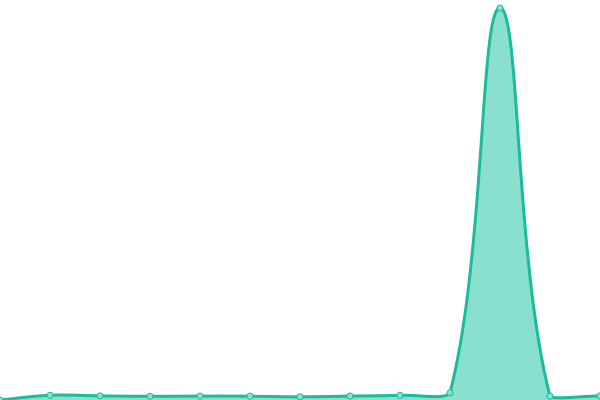
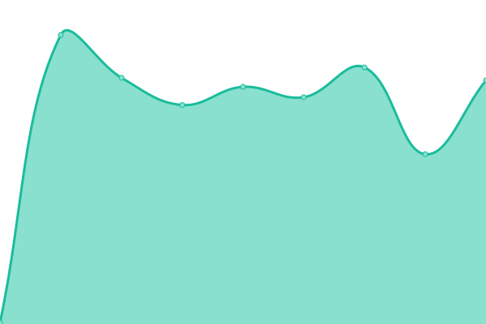

# [📈 Live Status](https://dhlee-dareesoft.github.io/upptime): <!--live status--> **🟩 All systems operational**

This repository contains the open-source uptime monitor and status page for [dhlee-dareesoft](https://dhlee-dareesoft.github.io/upptime), powered by [Upptime](https://github.com/upptime/upptime).

With [Upptime](https://upptime.js.org), you can get your own unlimited and free uptime monitor and status page, powered entirely by a GitHub repository. We use [Issues](https://github.com/dhlee-dareesoft/upptime/issues) as incident reports, [Actions](https://github.com/dhlee-dareesoft/upptime/actions) as uptime monitors, and [Pages](https://dhlee-dareesoft.github.io/upptime) for the status page.

<!--start: status pages-->
<!-- This summary is generated by Upptime (https://github.com/upptime/upptime) -->
<!-- Do not edit this manually, your changes will be overwritten -->
<!-- prettier-ignore -->
| URL | Status | History | Response Time | Uptime |
| --- | ------ | ------- | ------------- | ------ |
|  [김천 WEB](https://public.riaas.ai) | 🟩 Up | [web.yml](https://github.com/dhlee-dareesoft/upptime/commits/HEAD/history/web.yml) | 

 931ms
     
 | 

<a href="https://dhlee-dareesoft.github.io/upptime/history/web">99.99%</a>
    

|  [김천 API](https://public.riaas.ai/api/v2/customers/1) | 🟩 Up | [api.yml](https://github.com/dhlee-dareesoft/upptime/commits/HEAD/history/api.yml) | 

 219ms
     
 | 

<a href="https://dhlee-dareesoft.github.io/upptime/history/api">100.00%</a>
    

|  [광주 WEB](https://gwangju.riaas.ai) | 🟩 Up | [web.yml](https://github.com/dhlee-dareesoft/upptime/commits/HEAD/history/web.yml) | 

 931ms
     
 | 

<a href="https://dhlee-dareesoft.github.io/upptime/history/web">99.99%</a>
    

|  [광주 API](https://gwangju.riaas.ai/api/v2/customers/1) | 🟩 Up | [api.yml](https://github.com/dhlee-dareesoft/upptime/commits/HEAD/history/api.yml) | 

 219ms
     
 | 

<a href="https://dhlee-dareesoft.github.io/upptime/history/api">100.00%</a>
    

|  [구독 WEB](https://korea.riaas.ai) | 🟩 Up | [web.yml](https://github.com/dhlee-dareesoft/upptime/commits/HEAD/history/web.yml) | 

 931ms
     
 | 

<a href="https://dhlee-dareesoft.github.io/upptime/history/web">99.99%</a>
    

|  [구독 API](https://korea.riaas.ai/api/v2/customers/1) | 🟩 Up | [api.yml](https://github.com/dhlee-dareesoft/upptime/commits/HEAD/history/api.yml) | 

 219ms
     
 | 

<a href="https://dhlee-dareesoft.github.io/upptime/history/api">100.00%</a>
    

|  [redact](http://35.222.58.120:8787/services/v3/status) | 🟩 Up | [redact.yml](https://github.com/dhlee-dareesoft/upptime/commits/HEAD/history/redact.yml) | 

 364ms
     
 | 

<a href="https://dhlee-dareesoft.github.io/upptime/history/redact">100.00%</a>
    

|  [prestd](https://korea.riaas.ai/prest/schemas) | 🟩 Up | [prestd.yml](https://github.com/dhlee-dareesoft/upptime/commits/HEAD/history/prestd.yml) | 

 193ms
     
 | 

<a href="https://dhlee-dareesoft.github.io/upptime/history/prestd">100.00%</a>
    

<!--end: status pages-->

[**Visit our status website →**](https://dhlee-dareesoft.github.io/upptime)

## 📄 License

- Powered by: [Upptime](https://github.com/upptime/upptime)
- Code: [MIT](./LICENSE) © [dhlee-dareesoft](https://dhlee-dareesoft.github.io/upptime)
- Data in the `./history` directory: [Open Database License](https://opendatacommons.org/licenses/odbl/1-0/)
